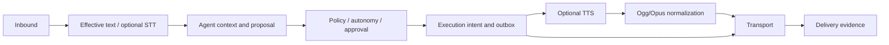

# Attention Router / Andy

[](https://github.com/escossio/attention-router/actions/workflows/ci.yml?query=branch%3Apublic-release-candidate-20260908)
[](LICENSE)

**Attention Router is a contextual agent runtime for controlled, policy-aware autonomous interactions.** Andy is its principal conversational agent: context-aware assistance with explicit limits on what an agent may do.

## Why

A useful agent needs more than a generated reply. It must identify the conversation, carry relevant context, respect human control, authorize effects, and distinguish a proposed response from one actually delivered.

Attention Router makes those boundaries explicit and auditable. WhatsApp is an integration, not the product's entire architecture.

## Current capabilities

- Structured inbound processing, tenant/contact scope and idempotent event handling.
- An optional OpenAI Agents SDK adapter with bounded, structured context.
- Policies, autonomy evaluation, human approval and durable Owner Control.
- Recent bidirectional history: up to six prior interactions, with assistant entries backed by delivery evidence and a temporal cutoff for reprocessing.
- Separate persistent memory with eligibility, provenance and disclosure controls.
- Optional voice input/output, locale propagation, and Ogg/Opus normalization.
- Transactional execution/outbox boundaries, delivery-state tracking and health endpoints.

These are implemented components, not a promise that every configuration or provider is supported. The public baseline remains prerelease; PostgreSQL integration certification is an explicit release gate.

## Architecture



See [architecture and trust boundaries](docs/architecture/overview.md).

## Safety and human control

The model does not grant itself permission to act. Owner pause, policies and approval gates remain outside model authority. Proposed text, synthesized audio and confirmed delivery are different states. Ambiguous delivery is not proof of a conversation turn and must not be blindly replayed.

Local defaults disable provider-backed Agent, STT/TTS and external autonomous delivery. Loopback binding and example credentials are for local development, not a production security configuration. See [SECURITY.md](SECURITY.md).

## Voice and conversation context

The optional path is voice inbound -> transcript -> Agent -> authorized response -> external TTS -> Ogg/Opus -> transport. TTS is a separately versioned service; this repository contains the adapter, contract and mocked tests, not that service's deployment.

A resolved locale travels with a response even when its text is neutral, such as a number. This is not universal language detection or a guarantee of any provider's pronunciation. Recent history and long-term memory have different purposes and lifecycles.

## Quick Start: local core, no providers

Prerequisites: Git, Docker Engine and Docker Compose v2 with `--wait` support. Docker must be able to download base images and packages. No phone, browser profile, OpenAI key or TTS account is required.

```bash
git clone --branch public-release-candidate-20260908 --single-branch \
  git@github.com:escossio/attention-router.git
cd attention-router
cp .env.example .env
docker compose -p attention-router-demo up --build --wait db api
curl --fail http://127.0.0.1:8080/health/ready
```

During private staging, cloning requires repository access. The API starts only after database migrations and policy seeding succeed. PostgreSQL has no host port exposed; the API binds to loopback. Set `PUBLIC_HTTP_PORT` in `.env` if port 8080 is occupied.

This starts a core API and database, **not a live messaging agent**. To stop the demo while retaining its local database:

```bash
docker compose -p attention-router-demo down
```

`docker compose up --build` also starts the worker. The `channels` profile is opt-in and does not configure a real WhatsApp session for you. Full messaging, Agent and voice capabilities require separately configured credentials, authenticated services and authorization controls. Do not enable them just to run this demo.

More details: [local setup](docs/guides/quick-start.md).

## Provider-free demonstration and tests

An existing example exercises context and TTS adapter fixtures without contacting providers:

```bash
python3 -m venv .venv
. .venv/bin/activate
python -m pip install -e '.[dev]'
python examples/offline_context.py
python -m pytest -q
python -m ruff check .
python -m compileall -q attention_router tests
```

Use Python 3.12, Node.js 22 and local `ffmpeg` for parity with CI. The main Python profile excludes tests marked `postgres`; it must not be presented as PostgreSQL certification.

```bash
cd whatsapp-transport-local
PUPPETEER_SKIP_DOWNLOAD=true npm ci --ignore-scripts
npm test
cd ..
bash scripts/postgres_test_harness.sh
```

The PostgreSQL harness creates and removes a disposable container/database. Never point integration tests at a database containing valuable data. [Contributing](CONTRIBUTING.md) describes the CI jobs and remaining gates.

## Project status and future evolution

**Current:** prerelease private staging of a sanitized product baseline. The CI badge is authoritative for the branch's current job results; a prepared or skipped security workflow is not a passed scan. Quick Start proves only core health, not production readiness.

**Future, not implemented capabilities:** Conversation Session State for temporary activities; the modular workflow and enterprise concepts in [Andy Enterprise](docs/andy-enterprise-evolution.md); broader public demos and deployment guides. Game state must not automatically become long-term memory.

## License

[Apache License 2.0](LICENSE). Contribution and vulnerability-reporting guidance: [CONTRIBUTING.md](CONTRIBUTING.md), [SECURITY.md](SECURITY.md).
