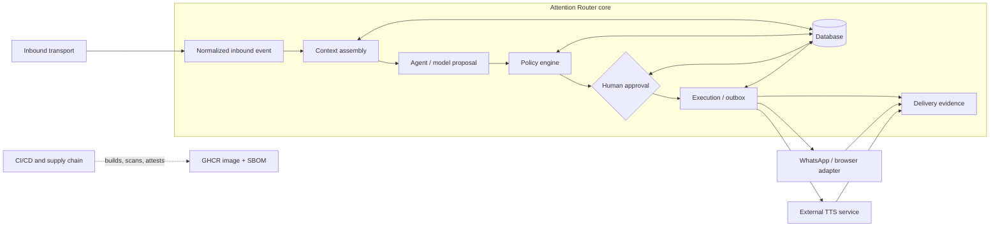

# Trust Boundaries

The model proposes; policy authorizes; human approval can release critical
work; execution creates effects; delivery evidence records what the external
boundary reports. The database is durable state, not an external-provider
acknowledgement.
