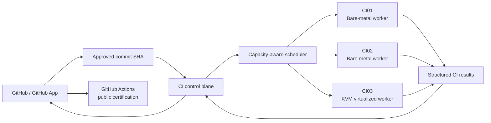

# Distributed CI Lab

This document describes the local distributed CI architecture used to accelerate Attention Router validation while preserving GitHub Actions as the public certification authority.

## Architecture

The local workers do not replace GitHub Actions. They provide fast pre-certification feedback for an exact approved SHA; the public repository's GitHub-hosted CI, CodeQL and secret scanning remain independent release evidence.

## Worker model

| Worker | Execution model | Primary role |
| --- | --- | --- |
| CI01 | Bare metal | PostgreSQL shard, Python validation, Docker workloads |
| CI02 | Bare metal | Weighted PostgreSQL shard, transport / SDK validation |
| CI03 | KVM virtualized | High-throughput weighted PostgreSQL shard and fast validation |

Workers use disposable Git worktrees, synthetic databases, exact-SHA execution and persistent dependency caches. PostgreSQL integration runs inside disposable containers with test-only data. No production credentials or production databases are required for this pipeline.

## Capacity-aware scheduling

The PostgreSQL suite is not split by test count. Historical duration profiling is used to distribute files according to measured cost and worker throughput.

For the benchmark below, the weighted planner produced:

- CI01: 15 PostgreSQL test files, 106 tests;
- CI02: 9 PostgreSQL test files, 136 tests;
- CI03: 17 PostgreSQL test files, 161 tests.

Although the test counts differ, the three shards completed within roughly one second of each other.

## Benchmark

Benchmark date: **2026-09-19**  
Target SHA: `733386337cdad9a92e5950c39df3c75d0f487463`  
PostgreSQL tests: **403**

### Single-worker baselines

| Worker | pytest time | End-to-end PostgreSQL gate |
| --- | ---: | ---: |
| CI01 | 251.55 s | 286 s |
| CI02 | 414.04 s | 473 s |
| CI03 | 181.38 s | 212 s |

### Weighted three-worker run

| Worker | Tests | pytest time | End-to-end shard |
| --- | ---: | ---: | ---: |
| CI01 | 106 | 86.28 s | 96 s |
| CI02 | 136 | 86.48 s | 99 s |
| CI03 | 161 | 87.35 s | 96 s |

**Distributed wall-clock time: 99 seconds.**

Compared with the original CI01 full PostgreSQL run, this reduced the gate from **286 s to 99 s**: about **65% less wall-clock time** and roughly **2.9x faster**.

Compared with the fastest single worker in the same lab, CI03, the distributed run reduced the gate from **212 s to 99 s**: about **53% less wall-clock time** and roughly **2.1x faster**.

## Persistent dependency environment cache

The executor keys its Python environment by the Python ABI and a hash of `pyproject.toml`. A warm fast gate on the same dependency set measured:

- CI01: 4 s
- CI02: 6 s
- CI03: 4 s

This avoids recreating and reinstalling a full virtual environment for every disposable Git worktree while keeping source checkout isolation.

## Security boundaries

The local cluster follows these constraints:

- only an exact approved commit SHA is executed;
- disposable worktrees are used for each run;
- PostgreSQL data is synthetic and disposable;
- production application secrets are not copied to CI workers;
- the virtualized worker provides an additional isolation boundary;
- the public repository is not directly attached to a privileged LAN self-hosted runner;
- GitHub-hosted CI remains the independent public certification path.

## Why this exists

The purpose is not to replace public CI with private infrastructure. The local lab shortens the feedback loop so expensive integration failures can be found before waiting for GitHub-hosted runners, while preserving a separate public certification layer.
