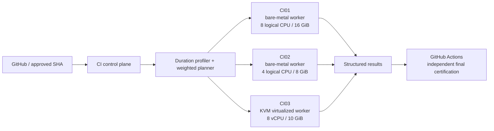

# Heterogeneous distributed CI lab

Status: self-managed preflight accelerator. GitHub Actions remains the authoritative public certification path.

This package documents the distributed CI control plane used to accelerate the Attention Router PostgreSQL integration suite without attaching a persistent self-hosted runner directly to the public repository.

## Architecture



The workers are deliberately heterogeneous. The scheduler does not split by test count. A profiling run captures pytest setup/call/teardown durations, aggregates them by test file, normalizes each worker by measured throughput, and assigns the heaviest files to the worker that minimizes predicted completion time.

## Execution model

The control plane accepts only an explicit 40-character Git commit SHA. Every worker independently fetches and verifies that exact commit before creating a disposable detached worktree.

Python dependencies are cached in a persistent virtual environment keyed by Python ABI plus the `pyproject.toml` hash. The current project worktree is rebound into that environment with `--no-deps -e`, avoiding dependency reinstall on every run while keeping source isolation.

PostgreSQL 16 is disposable and synthetic-only. Its data directory runs in tmpfs sized from worker RAM and capped at 6 GiB. Durability settings are disabled only inside this disposable test database.

A scheduler profile contains the complete PostgreSQL test-file set. If a target SHA adds or removes a PostgreSQL test file, the distributed runner returns `REPROFILE_REQUIRED` instead of silently reducing coverage.

GitHub Actions, CodeQL and the public repository gates remain independent of this lab.

## Measured benchmark

Benchmark date: 2026-09-19. Benchmark commit: `733386337cdad9a92e5950c39df3c75d0f487463`.

The profiled suite contained **403 PostgreSQL integration tests across 41 files**.

| Measurement | Result |
| --- | ---: |
| Initial single-worker CI01 PostgreSQL run | 286 s |
| Weighted distributed worker wall time | **99 s** |
| End-to-end control-plane invocation | **~103 s** |
| End-to-end reduction vs. initial CI01 baseline | **~64%** |
| End-to-end speedup vs. initial CI01 baseline | **~2.78x** |
| Warm fast gate, CI01 | **4 s** |
| Warm fast gate, CI02 | **6 s** |
| Warm fast gate, CI03 | **4 s** |

The measured weighted run completed as follows:

| Worker | Class | Assigned files | Passed tests | Worker duration |
| --- | --- | ---: | ---: | ---: |
| CI03 | KVM virtualized | 17 | 161 | 96 s |
| CI01 | bare metal | 15 | 106 | 96 s |
| CI02 | bare metal | 9 | 136 | 99 s |

The similar completion times are the intended behavior: historical test cost and worker throughput, rather than equal test counts, determine the split.

## Control-plane commands

After host-specific SSH aliases and worker installation are configured:

```bash
andy-ci-reprofile <40-char-sha>
andy-ci-distributed <40-char-sha> postgres
```

`andy-ci-reprofile` executes one full duration-instrumented run on the primary compute worker only when the exact PostgreSQL test-file set has no cached profile. Profiles are keyed by a deterministic SHA-256 of the C-locale-sorted file list, so switching between branches with different test sets does not thrash one global profile.

`andy-ci-distributed` resolves the exact-SHA test-file set, selects its cached profile, verifies worker readiness, copies generated shard manifests, starts all workers concurrently, waits for every result and writes a structured JSON summary.

## Package contents

- `worker/andy-ci-run`: exact-SHA worker executor with disposable worktrees, dependency caching and PostgreSQL shard support.
- `control-plane/andy-ci-distributed`: distributed orchestrator.
- `control-plane/andy-ci-reprofile`: safe profile refresh.
- `control-plane/plan-postgres.py`: duration-aware heterogeneous bin-packing planner.
- `examples/worker-capacity.benchmark.json`: benchmarked capacity model without network addressing.
- `examples/ssh-config.example`: alias pattern; real addresses and credentials stay outside Git.
- `benchmark-20260919.json`: machine-readable benchmark evidence.

## Security boundary

This is deliberately **not** a persistent GitHub-hosted-to-LAN self-hosted runner path.

The public repository contains no LAN addresses, SSH private keys, production environment files, GitHub App private keys, provider credentials or production database access. Host addressing and authorization remain local to the control plane. Workspaces are disposable, test databases contain synthetic data, and the virtualized worker provides an additional KVM isolation boundary.

For public pull requests, the `andy-github-control-plane` App binds execution to the current exact PR head SHA and publishes the aggregated result as the required `distributed-postgres` GitHub check. The PostgreSQL suite is therefore not rerun on a GitHub-hosted runner. GitHub Actions and CodeQL remain authoritative for the other repository-native gates.
