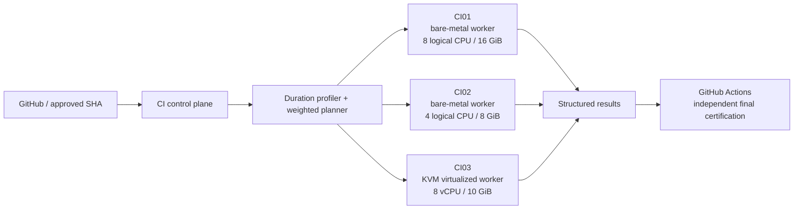

# Heterogeneous distributed CI lab

Status: self-managed exact-SHA CI execution. `distributed-python` and `distributed-postgres` are authoritative required checks; GitHub Actions retains lightweight public preflight and repository-native gates.

This package documents the distributed CI control plane used to accelerate the Attention Router PostgreSQL integration suite without attaching a persistent self-hosted runner directly to the public repository.

## Architecture


```mermaid
flowchart LR
    G[GitHub / approved SHA] --> C[CI control plane]
    C --> P[Duration profiler + weighted planner]
    P --> W3[CI03<br/>KVM virtualized worker<br/>8 vCPU / 10 GiB]
    P --> W1[CI01<br/>bare-metal worker<br/>8 logical CPU / 16 GiB]
    P --> W2[CI02<br/>bare-metal worker<br/>4 logical CPU / 8 GiB]
    W1 --> R[Structured results]
    W2 --> R
    W3 --> R
    R --> A[GitHub Actions<br/>independent final certification]
```

The workers are deliberately heterogeneous. The scheduler does not split by test count. A profiling run captures pytest setup/call/teardown durations, aggregates them by test file, normalizes each worker by measured throughput, and assigns the heaviest files to the worker that minimizes predicted completion time.

## Control-plane workload policy

The control plane coordinates work; it is not a fourth heavy worker. When the distributed tooling is installed, full PostgreSQL, migration-heavy and other long regression gates must be sent to the worker pool instead of being executed locally on the control plane. Local execution is reserved for quick inspection, lint/diff checks and narrowly targeted diagnostics.

Heavy validation requires an exact published commit SHA. If a candidate is still uncommitted, run only the minimum local checks needed to make a safe feature-branch commit, publish that branch, then dispatch the exact SHA with `andy-ci-distributed <40-char-sha> postgres`. Do not silently fall back to a heavy local run when workers are unavailable; report the distributed gate as blocked. An operator may explicitly override this only for break-glass diagnostics.

This policy keeps CI01, CI02 and CI03 doing the work they were provisioned for and prevents the control plane from becoming the bottleneck.

## Execution model

The control plane accepts only an explicit 40-character Git commit SHA. Every worker independently fetches and verifies that exact commit before creating a disposable detached worktree.

Python dependencies are cached in a persistent virtual environment keyed by Python ABI plus the `pyproject.toml` hash. The current project worktree is rebound into that environment with `--no-deps -e`, avoiding dependency reinstall on every run while keeping source isolation.

PostgreSQL 16 is disposable and synthetic-only. Its data directory runs in tmpfs sized from worker RAM and capped at 6 GiB. Durability settings are disabled only inside this disposable test database.

A scheduler profile contains the complete PostgreSQL test-file set. If a target SHA adds or removes a PostgreSQL test file, the distributed runner returns `REPROFILE_REQUIRED` instead of silently reducing coverage.

GitHub Actions, CodeQL and the public repository gates remain independent of this lab.

## Measured benchmark

Benchmark date: 2026-09-19. Benchmark commit: `733386337cdad9a92e5950c39df3c75d0f487463`.

The profiled suite contained **403 PostgreSQL integration tests across 41 files**.

| Measurement | Result |
| --- | ---: |
| Initial single-worker CI01 PostgreSQL run | 286 s |
| Weighted distributed worker wall time | **99 s** |
| End-to-end control-plane invocation | **~103 s** |
| End-to-end reduction vs. initial CI01 baseline | **~64%** |
| End-to-end speedup vs. initial CI01 baseline | **~2.78x** |
| Warm fast gate, CI01 | **4 s** |
| Warm fast gate, CI02 | **6 s** |
| Warm fast gate, CI03 | **4 s** |

The measured weighted run completed as follows:

| Worker | Class | Assigned files | Passed tests | Worker duration |
| --- | --- | ---: | ---: | ---: |
| CI03 | KVM virtualized | 17 | 161 | 96 s |
| CI01 | bare metal | 15 | 106 | 96 s |
| CI02 | bare metal | 9 | 136 | 99 s |

The similar completion times are the intended behavior: historical test cost and worker throughput, rather than equal test counts, determine the split.

## Current PostgreSQL worker policy

The benchmark section below is historical evidence from the earlier heterogeneous
three-worker layout. It is **not** the current PostgreSQL scheduling policy.

For the current lab allocation, heavy PostgreSQL validation is pinned to exactly
one worker:

- default PostgreSQL worker: `ci03`;
- override: `ANDY_CI_POSTGRES_WORKER=<host-registry-id>`;
- `ci01` and `ci02` are excluded from PostgreSQL discovery, profiling and
  execution even if they still carry the legacy `postgres-worker` capability;
- if the selected PostgreSQL worker is busy or unavailable, the gate waits only
  for that worker within the existing bounded capacity timeout and then blocks;
- there is no silent PostgreSQL fallback to another worker.

The generic `python`, `transport` and `docker` schedulers remain capability-based and may continue using CI01/CI02/CI03 independently. `python` is now a required full-suite gate; `transport` and `docker` remain shadow checks until separately migrated.

This keeps the physical-worker choice explicit and replaceable without encoding
an IP address or local hostname in Git.

## Control-plane commands

After host-specific SSH aliases and worker installation are configured:

```bash
andy-ci-reprofile <40-char-sha>
andy-ci-distributed <40-char-sha> postgres
```

`andy-ci-reprofile` validates that the selected `ANDY_CI_POSTGRES_WORKER`
(default `ci03`) still has the `postgres-worker` capability, waits for that
exact worker, and profiles there. It never falls through to CI01/CI02.

`andy-ci-distributed` resolves the exact-SHA test-file set and dispatches the
PostgreSQL gate only to the selected PostgreSQL worker. Worker busy/loss remains
a bounded infrastructure condition; a real test failure remains terminal.

## Package contents

- `worker/andy-ci-run`: exact-SHA worker executor with disposable worktrees, dependency caching and PostgreSQL shard support.
- `control-plane/andy-ci-distributed`: capability-based distributed orchestrator with infrastructure requeue.
- `control-plane/andy-ci-reprofile`: failover-safe profile refresh.
- `control-plane/host-registry.py`: local SQLite source of host identity, capabilities, dependencies and reconciled health.
- `control-plane/replan-postgres.py`: redistributes pending PostgreSQL files across the currently eligible pool.
- `control-plane/plan-postgres.py`: duration-aware heterogeneous bin-packing planner.
- `examples/worker-capacity.benchmark.json`: benchmarked capacity model without network addressing.
- `examples/ssh-config.example`: alias pattern; real addresses and credentials stay outside Git.
- `benchmark-20260919.json`: machine-readable benchmark evidence.


## Distributed generic suites

The worker executor already supports `python`, `transport` and `docker` suites in addition to PostgreSQL. The generic shadow scheduler exposes those existing worker capabilities without replacing the proven sharded PostgreSQL scheduler:

```bash
andy-ci-distributed-suite <40-char-sha> python
andy-ci-distributed-suite <40-char-sha> transport
andy-ci-distributed-suite <40-char-sha> docker
```

The scheduler asks the Host Registry for the generic `ci-worker` capability. During the migration window it may explicitly fall back to the existing `postgres-worker` pool, which is logged as `CI_DISTRIBUTED_CAPABILITY_FALLBACK`. This fallback is safe for the current lab because the same installed worker executor implements all three generic suites; the intended steady state is to grant `ci-worker` explicitly.

Generic suites are whole-suite jobs rather than test-file shards. Concurrent shadow checks deliberately use different stable starting offsets in the benchmark-ordered worker list, so `python`, `docker` and `transport` normally begin on different workers. The worker lock remains authoritative: a collision returns `CI_WORKER_BUSY`, and the scheduler tries the next eligible worker. Worker loss and SSH failures fail over; a real suite failure is terminal and is not retried on another machine.

The GitHub App publishes three generic exact-SHA checks:

- `distributed-python` — **required** and authoritative for the full Python test suite;
- `distributed-transport` — non-required shadow check;
- `distributed-docker` — non-required shadow check.

The Python migration is complete. GitHub-hosted `python-tests` remains required only as a lightweight public preflight: dependency install, Ruff, compileall, generated SDK verification and standalone Python SDK wheel validation. It no longer executes the full `pytest` suite.

The worker-owned `distributed-python` check executes `run_python`, including the same fast validations plus the standalone SDK test and `python -m pytest -q`, on the self-managed worker pool. AGT coordinates exact-SHA dispatch and does not execute the heavy suite locally.

`transport-tests` and `docker-build` remain GitHub-hosted required checks while `distributed-transport` and `distributed-docker` continue their certification phase. `distributed-postgres` remains independently required and unchanged.

## Security boundary

This is deliberately **not** a persistent GitHub-hosted-to-LAN self-hosted runner path.

The public repository contains no LAN addresses, SSH private keys, production environment files, GitHub App private keys, provider credentials or production database access. Host addressing and authorization remain local to the control plane. Workspaces are disposable, test databases contain synthetic data, and the virtualized worker provides an additional KVM isolation boundary.

For public pull requests, the `andy-github-control-plane` App binds execution to the current exact PR head SHA and publishes required `distributed-python` and `distributed-postgres` checks. Neither full suite is rerun on a GitHub-hosted runner. GitHub Actions remains authoritative for lightweight public preflight, transport, Docker build and secret scanning; CodeQL remains an independent repository-native gate.
